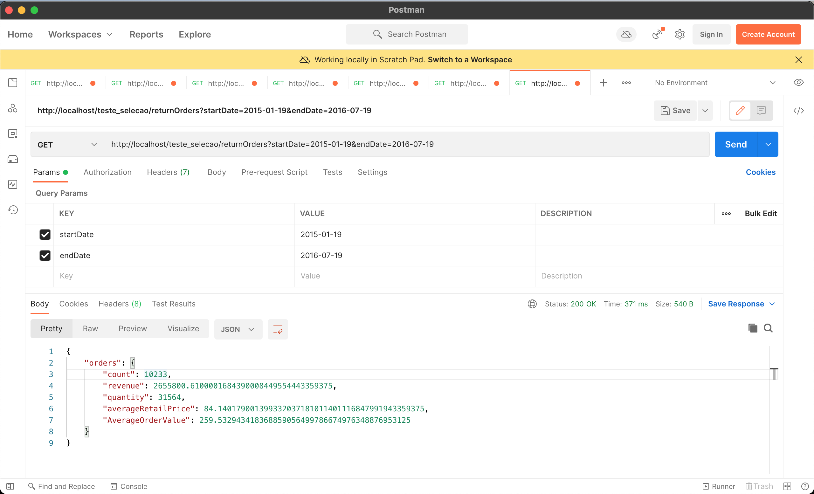

## Sobre

Desenvolvido em:
- API Rest em Lumen (5.8.12)
- PHP Version 7.4.27

Executado em servidor apache pelo xampp

Executar projeto:
```
git clone https://github.com/suelenprisciladev/teste_selecao.git

Dentro da pasta do projeto, executar
composer install

criar arquivo .env com as configurações do banco de dados
```

Entregáveis:

1) Tarefa 1: arquivo na raiz "tarefa_1.sql".
2) Tarefa 2: arquivo na raiz "config.php" com configurações do banco de dados
    1) teste_selecao/app/Http/Controllers/Pmweb_Orders_StatsController.php
    2) teste_selecao/app/Repositories/Pmweb_Orders_StatsRepository.php
3) Tarefa 3:
    1) Rota da api para retorno: http://localhost/teste_selecao/returnOrders - Parâmetros necessários para rota GET "startDate" e "endDate".

###### Print do retorno da rota executada no postaman.



 
